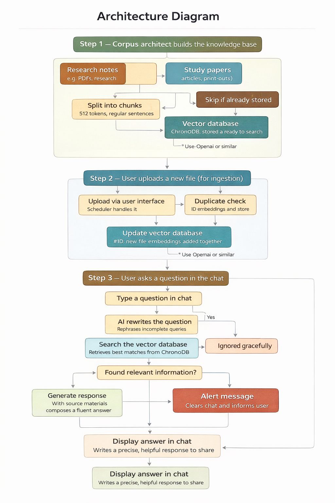

# Deep Learning RAG Agent

## Overview
This project implements a Retrieval-Augmented Generation (RAG) system for deep learning concepts.

## Features
- Custom knowledge base (ANN, CNN, RNN)
- Text chunking
- Embedding generation using Sentence Transformers
- Vector search using FAISS
- Query-based retrieval
- Answer generation

## Architecture



**Components:**
1. Data Loading
2. Chunking
3. Embeddings
4. Vector Database
5. Retrieval
6. Answer Generation

## How to Run

```bash
pip install -r requirements.txt
python src/rag_agent/rag_pipeline.py